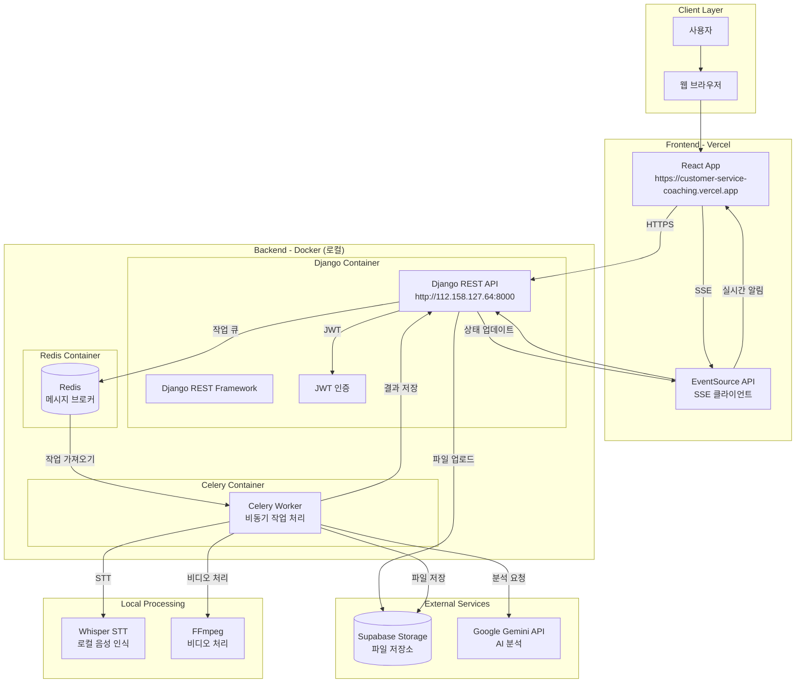
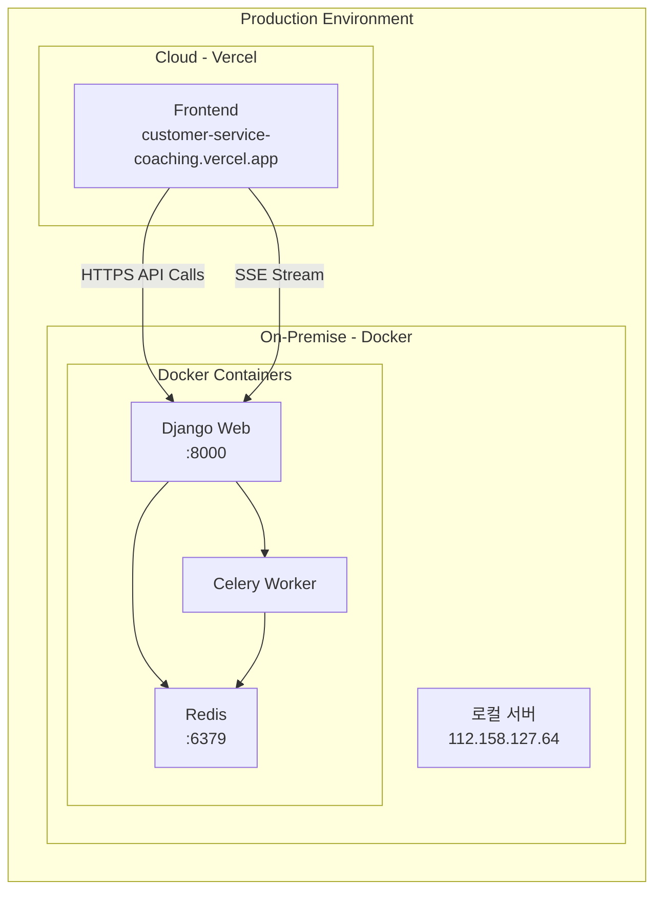
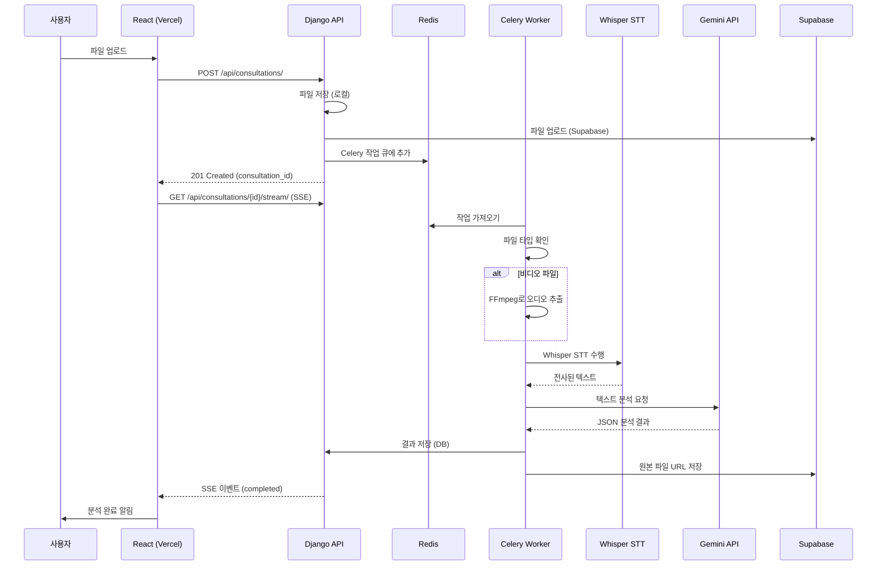
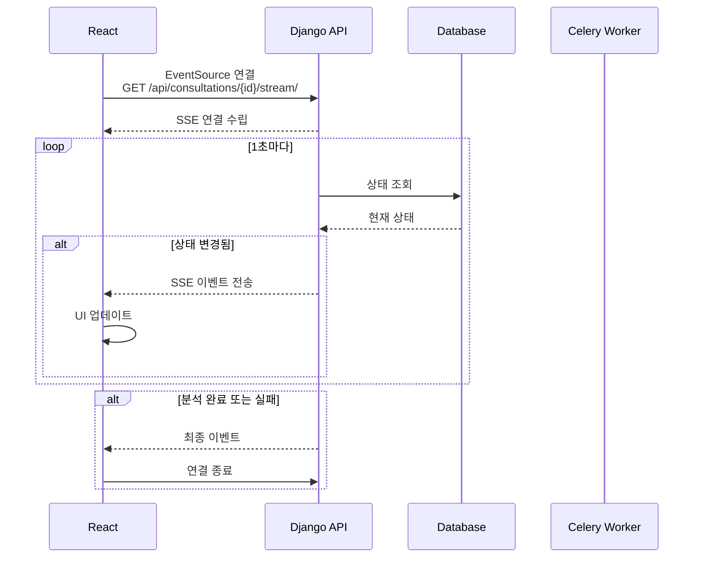
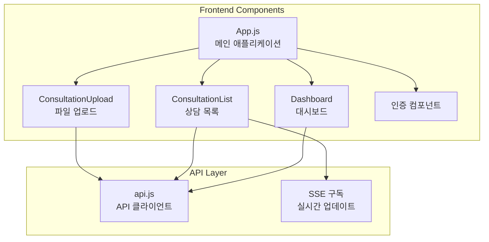
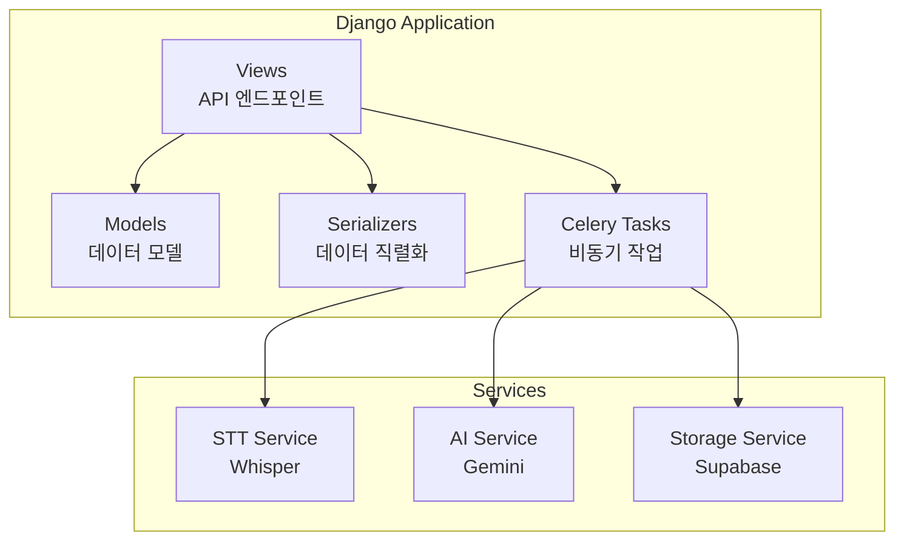
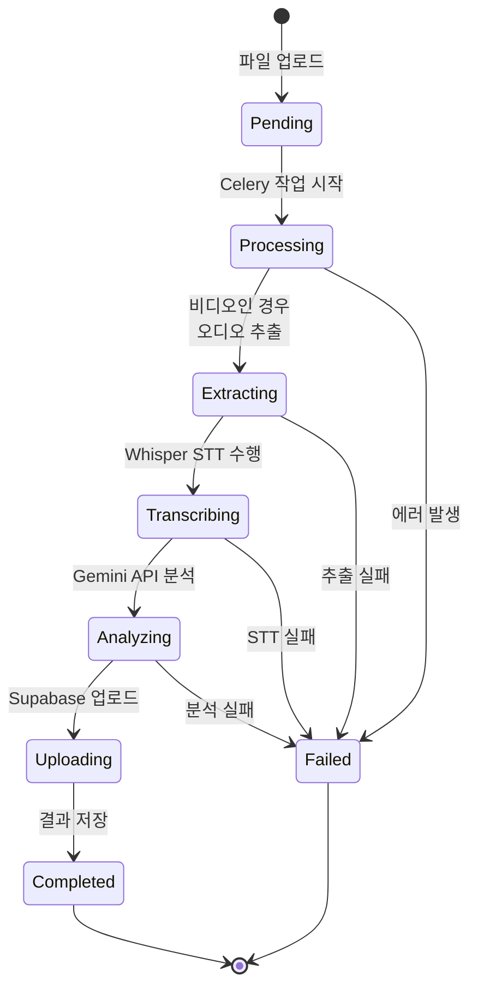
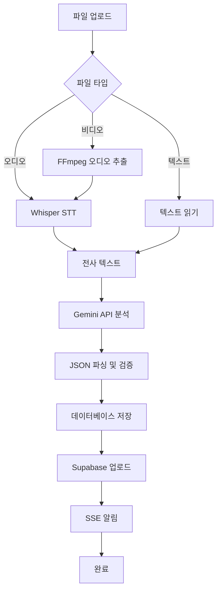
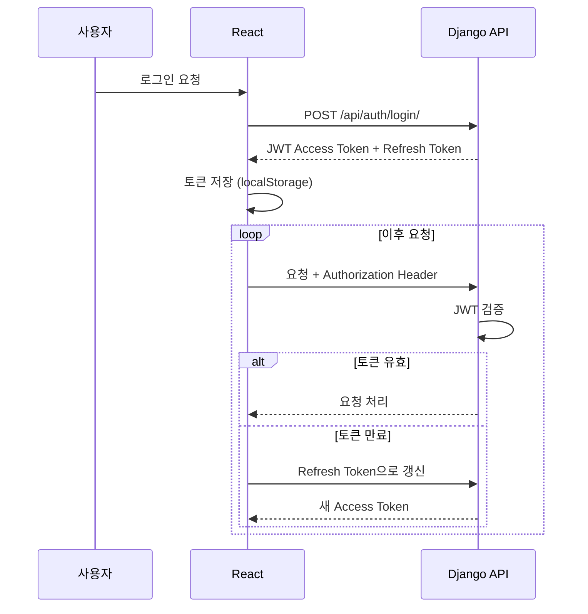
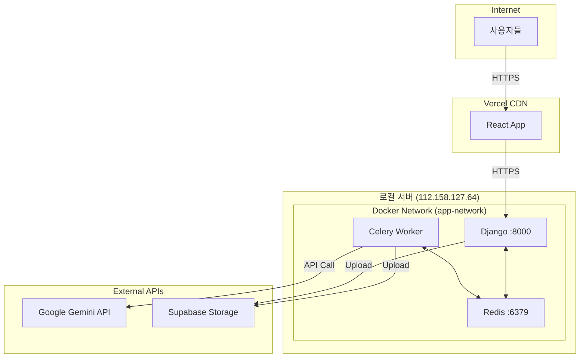

# 고객 상담 코칭 시스템 아키텍처 문서

## 📋 목차

1. [시스템 개요](#시스템-개요)
2. [전체 아키텍처](#전체-아키텍처)
3. [배포 구조](#배포-구조)
4. [데이터 흐름](#데이터-흐름)
5. [주요 컴포넌트](#주요-컴포넌트)
6. [기술 스택](#기술-스택)
7. [API 엔드포인트](#api-엔드포인트)
8. [비동기 처리 흐름](#비동기-처리-흐름)

---

## 시스템 개요

고객 상담 품질 향상을 위한 AI 기반 분석 시스템으로, 상담 대화 내용(텍스트/오디오/비디오)을 업로드하고 자동으로 분석하여 개선 사항을 도출합니다.

### 주요 기능
- **파일 업로드**: 텍스트, 오디오, 비디오 파일 업로드
- **STT 처리**: 로컬 Whisper를 사용한 음성-텍스트 변환
- **AI 분석**: Google Gemini API를 통한 상담 품질 분석
- **실시간 알림**: SSE를 통한 분석 진행 상황 실시간 업데이트
- **결과 조회**: 구조화된 JSON 형식의 분석 결과 제공

---

## 전체 아키텍처



---

## 배포 구조



### 배포 정보

| 컴포넌트 | 배포 위치 | URL/주소 | 기술 |
|---------|----------|---------|------|
| Frontend | Vercel | https://customer-service-coaching.vercel.app | React |
| Backend API | Docker (로컬) | http://112.158.127.64:8000 | Django |
| Redis | Docker (로컬) | 112.158.127.64:6379 | Redis |
| Celery Worker | Docker (로컬) | 내부 네트워크 | Celery |

---

## 데이터 흐름

### 1. 파일 업로드 및 분석 요청 흐름



### 2. 실시간 상태 업데이트 흐름 (SSE)



---

## 주요 컴포넌트

### Frontend (React + Vercel)



**주요 기능:**
- 파일 업로드 UI
- 상담 목록 조회 및 필터링
- 실시간 분석 상태 모니터링 (SSE)
- 분석 결과 시각화
- JWT 기반 인증

### Backend (Django + Docker)



**주요 모듈:**
- **coaching/views.py**: API 엔드포인트 (CRUD, SSE, 다운로드)
- **coaching/models.py**: Consultation, User 모델
- **coaching/tasks.py**: Celery 비동기 작업 (분석, STT)
- **coaching/storage.py**: Supabase 파일 업로드 유틸리티

### Celery Worker

**주요 작업:**
- `analyze_consultation`: 상담 파일 분석
  - 파일 타입별 처리 (텍스트/오디오/비디오)
  - 로컬 STT 처리 (Whisper)
  - AI 분석 (Gemini API)
  - 결과 저장 및 파일 업로드

---

## 기술 스택

### Frontend
| 기술 | 용도 | 버전 |
|------|------|------|
| React | UI 프레임워크 | Latest |
| EventSource API | SSE 클라이언트 | Native |
| Axios/Fetch | HTTP 클라이언트 | - |

### Backend
| 기술 | 용도 | 버전 |
|------|------|------|
| Django | 웹 프레임워크 | 4.2.27 |
| Django REST Framework | API 개발 | 3.16.1 |
| Celery | 비동기 작업 처리 | 5.6.2 |
| Redis | 메시지 브로커 | 7-alpine |
| JWT | 인증 | djangorestframework-simplejwt |
| drf-yasg | API 문서화 | 1.21.11 |

### AI & Processing
| 기술 | 용도 | 버전 |
|------|------|------|
| Google Gemini API | 텍스트 분석 | gemini-2.0-flash |
| OpenAI Whisper | 로컬 STT | openai-whisper |
| FFmpeg | 비디오 처리 | 8.0.1 |

### Storage & Infrastructure
| 기술 | 용도 |
|------|------|
| Supabase Storage | 클라우드 파일 저장소 |
| Docker | 컨테이너화 |
| Docker Compose | 멀티 컨테이너 관리 |
| Vercel | 프론트엔드 배포 |

---

## API 엔드포인트

### 인증 API

```
POST   /api/auth/register/          # 회원가입
POST   /api/auth/login/             # 로그인 (JWT 토큰 발급)
POST   /api/auth/token/refresh/     # 토큰 갱신
POST   /api/auth/token/verify/      # 토큰 검증
GET    /api/auth/me/                # 현재 사용자 정보
```

### 상담 API

```
GET    /api/consultations/                    # 상담 목록 조회 (필터링 지원)
POST   /api/consultations/                    # 상담 파일 업로드 및 분석 시작
GET    /api/consultations/{id}/              # 상담 상세 조회
GET    /api/consultations/{id}/stream/       # SSE 스트림 (실시간 상태)
GET    /api/consultations/{id}/download/     # 원본 파일 다운로드
```

### API 문서
- **Swagger UI**: http://112.158.127.64:8000/swagger/
- **ReDoc**: http://112.158.127.64:8000/redoc/

---

## 비동기 처리 흐름

### 상담 분석 프로세스



### 파일 처리 파이프라인



---

## 보안 및 인증

### 인증 흐름



### 데이터 격리
- 사용자별 데이터 격리: 각 사용자는 자신의 상담 데이터만 조회 가능
- JWT 기반 인증: 모든 API 요청에 인증 필요
- 파일 접근 제어: Supabase에서 사용자별 권한 관리

---

## 스토리지 구조

### 로컬 저장소 (Docker Volume)
```
backend/media/
└── consultations/
    └── {consultation_id}_{filename}
```

### Supabase Storage
```
Bucket: customer-service-coaching
├── consultation_{id}_{filename}
└── ...
```

### 데이터베이스 (SQLite/PostgreSQL)
```
Consultation Model:
- id, title, file, file_type
- status (pending/processing/completed/failed)
- original_content (전사된 텍스트)
- analysis_result (JSON 분석 결과)
- supabase_file_url
- user (외래키)
- created_at, updated_at, completed_at
```

---

## 모니터링 및 로깅

### 로그 수집
- **Django**: 애플리케이션 로그
- **Celery**: 작업 실행 로그
- **Redis**: 연결 및 작업 큐 로그

### 주요 메트릭
- API 응답 시간
- Celery 작업 처리 시간
- STT 처리 시간
- AI API 호출 성공률
- 파일 업로드/다운로드 성공률

---

## 확장성 고려사항

### 현재 구조
- 단일 서버 배포 (로컬 Docker)
- SQLite 데이터베이스
- 단일 Celery Worker

### 확장 가능한 구조
- **수평 확장**: Celery Worker 다중화
- **데이터베이스**: PostgreSQL 마이그레이션
- **로드 밸런싱**: Nginx 리버스 프록시
- **캐싱**: Redis 캐시 레이어 추가
- **모니터링**: Prometheus + Grafana

---

## 네트워크 아키텍처



---

## 에러 처리 및 재시도

### Celery 작업 재시도
- **할당량 초과**: Gemini API 할당량 초과 시 자동 재시도 (최대 3회, exponential backoff)
- **STT 실패**: Whisper 전사 실패 시 에러 메시지 저장
- **파일 업로드 실패**: Supabase 업로드 실패 시 로컬 파일만 사용

### 사용자 피드백
- 실시간 상태 업데이트 (SSE)
- 상세한 에러 메시지 제공
- 분석 결과 JSON 형식으로 구조화

---

## 참고 자료

- **프론트엔드**: https://customer-service-coaching.vercel.app/dashboard
- **백엔드 API**: http://112.158.127.64:8000
- **API 문서**: http://112.158.127.64:8000/swagger/
- **프로젝트 README**: [README.md](./README.md)
- **KPI 시트**: [KPI_SHEET.md](./KPI_SHEET.md)

---

**문서 버전**: 1.0  
**최종 업데이트**: 2025년 1월  
**작성자**: Development Team

